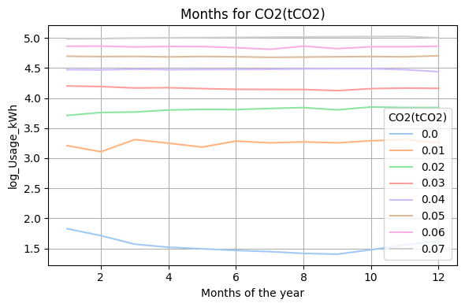

# Energy Consumption in the Steel Industry

This project analyzes real-world energy consumption data in the steel industry using data analysis techniques and a regression model. The main objective is to understand the factors that influence energy usage and to build a predictive model.

## Project Description

The notebook performs exploratory data analysis, variable cleaning and transformation, and trains a regression model to predict energy consumption. Metrics such as **RMSE** and **R²** are used to evaluate the model’s performance.

## Technologies and Libraries Used

- Python 3.x
- Pandas
- NumPy
- Seaborn and Matplotlib
- Scikit-learn
- Statsmodels

## Project Structure

- `steel_industry_energy.ipynb`: Main notebook containing the full analysis.
- `steel_industry_data.csv`: Dataset with records of energy consumption, timestamps, reactive power factors, etc.

## Analysis Steps

1. **Data Loading**  
   Read the `.csv` file and review data quality.

2. **Cleaning and Transformation**  
   - Convert timestamps
   - Feature engineering (month, hour, etc.)
   - Drop redundant columns

3. **Data Visualization**  
   - Correlation analysis
   - Consumption trends by hour and operating conditions

4. **Predictive Modeling**  
   - Linear regression to predict energy consumption
   - Model evaluation using R² and RMSE

## Results

The model provides a reasonable estimate of energy consumption based on variables such as date, power factors, and operational conditions.

## Author

Mateo Chavez
